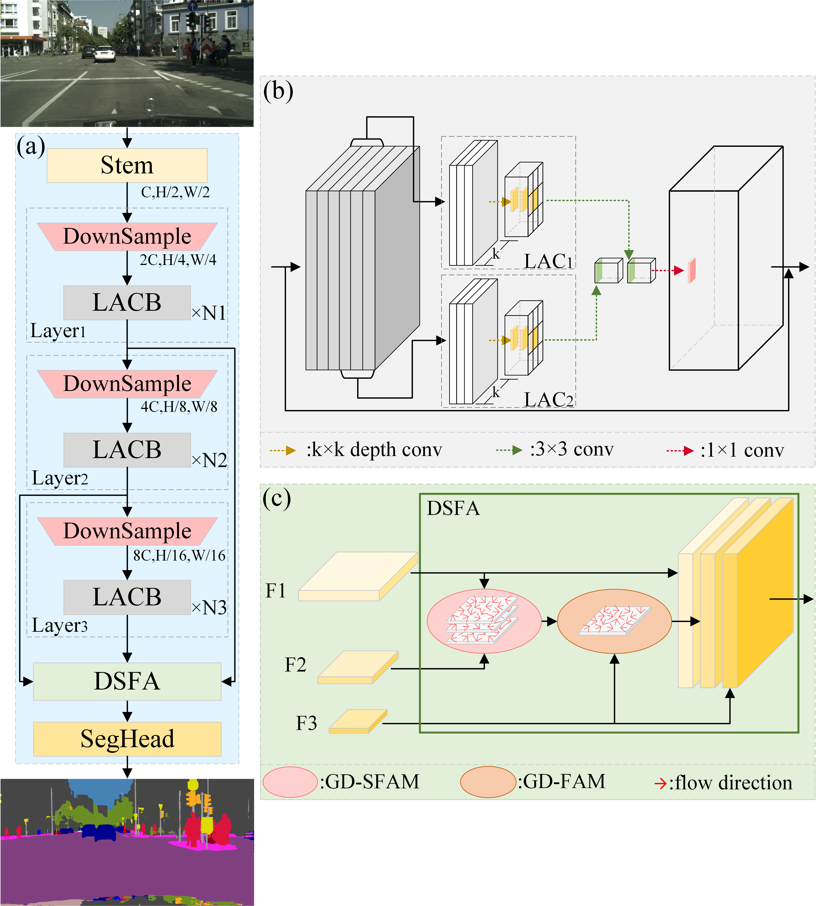

# DSANet

<div>
  
</div>


## Performance
CItyscapes val sets:

| Methods  |   Size    | Params(M) | Flops(G) | Speed(FPS) | mIoU  |                                      logs                                      |                                                                                                                 checkpoint                                                                                                                 |
|:--------:|:---------:|:---------:|:--------:|:----------:|:-----:|:------------------------------------------------------------------------------:|:------------------------------------------------------------------------------------------------------------------------------------------------------------------------------------------------------------------------------------------:|
|  DSANet  | 512x1024  |   1.17    |   5.39   |    110     | 75.6  | [logs](../tools/work_dirs/dsanet_cityscapes_512x1024/20260726_105627_dsc7565/) |                     [BaiDuDisk](https://pan.baidu.com/s/1RWRFqprvdJ8x5-7gSGoT4g#list/path=%2FDSANet_pth%2Fcityscapes)/[google](https://drive.google.com/file/d/1ROsoJvBqb4N6Sp09b2_bMzvp95ymZoW0/view?usp=drive_link)                      |
|  DSANet  | 768x1536  |   1.17    |  12.13   |     91     | 75.8  | [logs](../tools/work_dirs/dsanet_cityscapes_768x1536/20260727_130637_7584/)    |                     [BaiDuDisk](https://pan.baidu.com/s/1RWRFqprvdJ8x5-7gSGoT4g#list/path=%2FDSANet_pth%2Fcityscapes)/[google](https://drive.google.com/file/d/1tGz7e4cRhGKmtXsRZde9LEiiNrH4TgVl/view?usp=drive_link)                      |
  

CamVid test sets:

| Methods | Size    | Params(M) | Flops(G) | Speed(FPS)  | mIoU  |                                      logs                                       |                                                                                           checkpoint                                                                                           |
|:-------:|:-------:|:---------:|:--------:|:-----------:|:-----:|:-------------------------------------------------------------------------------:|:----------------------------------------------------------------------------------------------------------------------------------------------------------------------------------------------:|
| DSANet  | 576x768 |   1.17    |   4.54   |     116     | 80.2  |     [logs](../tools/work_dirs/dsanet_camvid_576x768/20260727_092653_8018/)      | [BaiDuDisk](https://pan.baidu.com/s/1RWRFqprvdJ8x5-7gSGoT4g#list/path=%2FDSANet_pth%2FCamVid) /[google](https://drive.google.com/file/d/1mrOnzTPnI15p3TRHZiJiKfpZxJY7SUDA/view?usp=drive_link) |
| DSANet  | 720x960 |   1.17    |   7.10   |     114     | 80.3  | [logs](../tools/work_dirs/dsanet_camvid_720x960/20260725_234316_camvid8026/)    | [BaiDuDisk](https://pan.baidu.com/s/1RWRFqprvdJ8x5-7gSGoT4g#list/path=%2FDSANet_pth%2FCamVid) /[google](https://drive.google.com/file/d/1HKrrMVm3OpUwau8B8CcyKErpyGDulGeJ/view?usp=drive_link) |


BDD100K val sets:

|      Methods       |   Size   | Params(M) | Flops(G) | Speed(FPS) | mIoU  |                                       logs                                       |                                                                                                                   checkpoint                                                                                                                   |
|:------------------:|:--------:|:---------:|:--------:|:----------:|:-----:|:--------------------------------------------------------------------------------:|:----------------------------------------------------------------------------------------------------------------------------------------------------------------------------------------------------------------------------------------------:|
|       DSANet       | 512x1024 |   1.17    |   5.39   |    110     | 52.4  |     [logs](../tools/work_dirs/dsanet_bdd100k_512x1024/20260727_091016_5243/)     |                 [BaiDuDisk](https://pan.baidu.com/s/1RWRFqprvdJ8x5-7gSGoT4g#list/path=%2FDSANet_pth%2FBDD100K&parentPath=%2F)/[google](https://drive.google.com/file/d/1kw2cODcGLw69UvaEqWbeuzDOHMqoyKCV/view?usp=drive_link)                  |
|       DSANet       | 720x1280 |   1.17    |   9.48   |    105     | 54.7  |     [logs](../tools/work_dirs/dsanet_bdd100k_720x1280/20260727_091939_5474/)     |                 [BaiDuDisk](https://pan.baidu.com/s/1RWRFqprvdJ8x5-7gSGoT4g#list/path=%2FDSANet_pth%2FBDD100K&parentPath=%2F)/[google](https://drive.google.com/file/d/1K-Y2oMNGm88JOVuzSUNmTrf7uZmZr3Lw/view?usp=drive_link)                  |
| DSANet(Cityscapes) | 512x1024 |   1.17    |   5.39   |    110     | 58.3  | [logs](../tools/work_dirs/dsanet_bdd100k_512x1024/20260728_185849_finetuned/)    |                 [BaiDuDisk](https://pan.baidu.com/s/1RWRFqprvdJ8x5-7gSGoT4g#list/path=%2FDSANet_pth%2FBDD100K&parentPath=%2F)/[google](https://drive.google.com/file/d/1uAX3cj7EX2QHEDNK4sPw20ORoEl3Cj1H/view?usp=drive_link)                  |

## Envs
Pytorch==2.0.0, CUDA==11.8

通过pip安装mim
```shell
pip install openmim
```
使用mim安装mmcv2.1.0版本
```shell
mim install mmcv==2.1.0
```
随后安装mmdet，mmengine
```shell
mim install mmdet==3.3.0
mim install mmengine==0.10.7
```
最后cd到项目路径，将本项目作为mmseg包安装
```shell
cd .../DSANet
pip install -e .
```
## train:
打开tools/train.py,从目录中的configs/dsanet/下选择配置文件并运行
or
```shell
python tools/train.py configs/dsanet/dsanet_cityscapes_512x1024.py
```

## test：
打开tools/test.py,从目录中的configs/dsanet/下选择配置文件,再选择对应的权重并运行
or
```shell
python tools/test.py configs/dsanet/dsanet_cityscapes_512x1024.py ckps/checkpoints.pth
```
## checkpoints


[百度网盘](https://pan.baidu.com/s/1RWRFqprvdJ8x5-7gSGoT4g)提取码: he85\
[BaiduDisk](https://pan.baidu.com/s/1RWRFqprvdJ8x5-7gSGoT4g)password: he85

[谷歌](https://drive.google.com/drive/folders/15EwOLltTol5fEmayS8EQSHZM9hsT5ltD?usp=drive_link)\
[google](https://drive.google.com/drive/folders/15EwOLltTol5fEmayS8EQSHZM9hsT5ltD?usp=drive_link)

